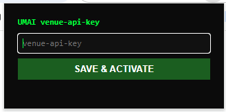

# UMAI Venue API Header Injector

Chrome MV3 extension that injects a `venue-api-key` header into UMAI
reservation widget requests, no separate browser-automation process
required.

## What it does

- Popup lets you paste a `venue-api-key`.
- Background service worker keeps one `declarativeNetRequest` dynamic rule
  alive that, on every request to `umai.io` / `letsumai.com`:
  - sets header `venue-api-key: <your key>`
  - sets `Origin: https://reservation.umai.io`
  - sets `Referer: https://reservation.umai.io/`
- Requests to `stripe.com` are excluded (`excludedRequestDomains`), so
  payment calls are never touched.
- Key is persisted in `chrome.storage.local`; clearing the field disables
  injection (rule removed).
- **Harvest button**: opens `reservation.umai.io/en/widget/rembayung` in a
  new tab (excluded from our own injection rule so it isn't masked), waits
  for the Cloudflare "Just a moment..." title to clear, then sniffs the
  `venue-api-key` header off the widget's own real request via
  `webRequest.onSendHeaders`. One click in the popup loads that fresh key
  into the field and activates it.

## Why declarativeNetRequest instead of webRequest

MV3 dropped blocking `webRequest`. `declarativeNetRequest`'s
`modifyHeaders` action is the supported replacement and runs in the
network layer before the request leaves Chrome — no content script or
page-context hook needed, and it survives Cloudflare's JS challenge since
it's not page-script-visible.

## Install (unpacked)

1. `chrome://extensions` → enable **Developer mode**.
2. **Load unpacked** → select this `umai-header-injector` folder.
3. Click the extension icon, paste your `venue-api-key`, **SAVE & ACTIVATE**.
4. Visit `https://reservation.umai.io/en/widget/<slug>` — requests now carry
   the header automatically.

## How to use

1. Get the venue's `venue-api-key` (from your account/venue dashboard, or by
   inspecting network requests on the widget page).
2. Click the extension icon in the Chrome toolbar to open the popup shown
   above.
3. Paste the key into the `venue-api-key` field.
4. Click **SAVE & ACTIVATE** — status line confirms injection is ON.
5. Reload or open the widget page; every `umai.io` / `letsumai.com` request
   now carries the header. Clear the field + save to turn injection back off.

## Scope

Targets `reservation.umai.io/en/widget/*` flows. Matches any host under
`umai.io` / `letsumai.com` per `host_permissions` in `manifest.json` — narrow
that list if you only need one venue's domain pattern.

## Files

| File | Purpose |
|---|---|
| `manifest.json` | MV3 manifest, permissions, host scope |
| `background.js` | builds/updates the single DNR rule from stored key |
| `popup.html` / `popup.js` | UI to set/clear the key |
